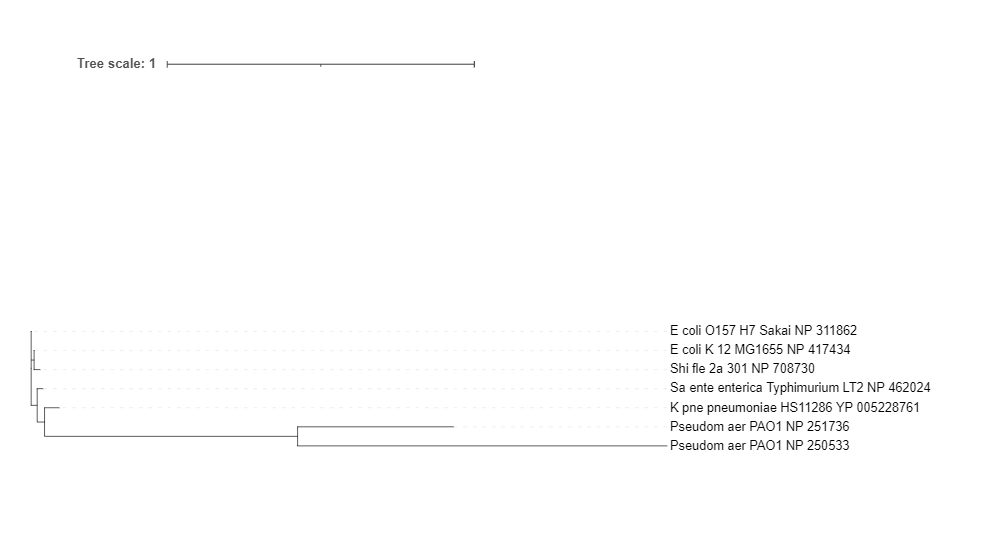

# YggL
## 数据下载
+ model organisms（outgroups）
```bash
GENUS=$(
    nwr member Bacteria -r genus |
        grep -v -i "Candidatus " |
        grep -v -i "candidate " |
        sed '1d' |
        cut -f 1 |
        tr "\n" "," |
        sed 's/,$//'
)

echo "
.headers ON

    SELECT
        *
    FROM ar
    WHERE 1=1
        AND genus_id IN ($GENUS)
        AND refseq_category IN ('reference genome')   #筛选条件
    " |
    sqlite3 -tabs ~/.nwr/ar_refseq.sqlite \
    > reference.tsv
```
| #tax_id | organism_name                                                    | phylum                |
|---------|------------------------------------------------------------------|-----------------------|
| 565050  | Caulobacter vibrioides NA1000                                    | Alphaproteobacteria   |
| 192222  | Campylobacter jejuni subsp. jejuni NCTC 11168 = ATCC 700819      | Epsilonproteobacteria |
| 208964  | Pseudomonas aeruginosa PAO1                                      | Gammaproteobacteria   |
| 871585  | Acinetobacter pittii PHEA-2                                      | Gammaproteobacteria   |
| 511145  | Escherichia coli str. K-12 substr. MG1655                        | Gammaproteobacteria   |
| 386585  | Escherichia coli O157:H7 str. Sakai                              | Gammaproteobacteria   |
| 1125630 | Klebsiella pneumoniae subsp. pneumoniae HS11286                  | Gammaproteobacteria   |
| 99287   | Salmonella enterica subsp. enterica serovar Typhimurium str. LT2 | Gammaproteobacteria   |
| 198214  | Shigella flexneri 2a str. 301                                    | Gammaproteobacteria   |
| 227377  | Coxiella burnetii RSA 493                                        | Gammaproteobacteria   |
| 272561  | Chlamydia trachomatis D/UW-3/CX                                  | Chlamydiae            |
| 93061   | Staphylococcus aureus subsp. aureus NCTC 8325                    | Firmicutes            |
| 224308  | Bacillus subtilis subsp. subtilis str. 168                       | Firmicutes            |
| 169963  | Listeria monocytogenes EGD-e                                     | Firmicutes            |
| 83332   | Mycobacterium tuberculosis H37Rv                                 | Actinobacteria        |

+ Gammaproteobacteria

Old ones: Cellvibrionales, Oceanospirillales, Pseudomonadales, and Alteromonadales

New ones: Moraxellales, Kangiellales, and Pseudomonadales
```bash
SPECIES=$(
    nwr member -r species \
        Cellvibrionales Oceanospirillales Alteromonadales \
        Moraxellales Kangiellales Pseudomonadales |
        grep -v -i "Candidatus " |
        grep -v -i "candidate " |
        grep -v " sp." |
        grep -v -E "\bbacterium\b" |
        grep -v -E "\bsymbiont\b" |
        sed '1d' |
        cut -f 1 |
        sort |
        uniq
)

for S in $SPECIES; do
    RS=$(
        echo "
            SELECT
                COUNT(*)
            FROM ar
            WHERE 1=1
                AND species_id = $S
            " |
            sqlite3 -tabs ~/.nwr/ar_refseq.sqlite
    )

    CHR=$(
        echo "
            SELECT
                COUNT(*)
            FROM ar
            WHERE 1=1
                AND species_id = $S
                AND assembly_level IN ('Complete Genome', 'Chromosome')
            " |
            sqlite3 -tabs ~/.nwr/ar_refseq.sqlite
    )

    if [[ ${RS} -gt 0 ]]; then
        echo -e "$S\t$RS\t$CHR"
    fi
done |
    nwr append stdin |
    tsv-select -f 1,4,2-3 |
    tsv-sort -k3,3nr -k4,4nr -k2,2 |
    (echo -e '#tax_id\tspecies\tRS\tCHR' && cat) \
    > species.count.tsv
```
 + download
```bash
SPECIES=$(
    cat species.count.tsv |
        tsv-filter -H --ge CHR:2 |
        sed '1d' |
        cut -f 1 |
        tr "\n" "," |
        sed 's/,$//'
)

# Pseudomonas aeruginosa PAO1 is in the reference list
cat reference.tsv |
    tsv-select -H -f organism_name,species,genus,ftp_path,assembly_level \
    > raw.tsv

echo "
    SELECT
        organism_name || ' ' || assembly_accession AS name,
        species, genus, ftp_path, assembly_level
    FROM ar
    WHERE 1=1
        AND species_id IN ($SPECIES)
        AND species NOT LIKE '% sp.%'
        AND organism_name NOT LIKE '% sp.%'
        AND assembly_level IN ('Complete Genome', 'Chromosome') #筛选条件
    " |
    sqlite3 -tabs ~/.nwr/ar_refseq.sqlite |
    tsv-filter --invert --str-eq 2:"Pseudomonas aeruginosa" --str-eq 5:"Chromosome" |
    tsv-filter --invert --str-eq 2:"Acinetobacter baumannii" --str-eq 5:"Chromosome" \
    >> raw.tsv

cat raw.tsv |
    grep -v '^#' |
    tsv-uniq |
    perl ~/Scripts/withncbi/taxon/abbr_name.pl -c "1,2,3" -s '\t' -m 3 --shortsub |
    (echo -e '#name\tftp_path\torganism\tassembly_level' && cat ) |
    perl -nl -a -F"," -e '
        BEGIN{my %seen};
        /^#/ and print and next;
        /^organism_name/i and next;
        $seen{$F[3]}++; # ftp_path
        $seen{$F[3]} > 1 and next;
        $seen{$F[5]}++; # abbr_name
        $seen{$F[5]} > 1 and next;
        printf qq{%s\t%s\t%s\t%s\n}, $F[5], $F[3], $F[1], $F[4];
        ' |
    keep-header -- sort -k3,3 -k1,1 \
    > Pseudomonas.assembly.tsv

# find potential duplicated strains or assemblies
cat Pseudomonas.assembly.tsv |
    tsv-uniq -f 1 --repeated

# Edit .tsv, remove unnecessary strains, check strain names and comment out poor assemblies.
# vim Pseudomonas.assembly.tsv
# cp Pseudomonas.assembly.tsv ~/Scripts/withncbi/pop

# Comment out unneeded strains

# Cleaning
rm raw*.*sv

perl ~/Scripts/withncbi/taxon/assembly_prep.pl \
    -f 。/Pseudomonas.assembly.tsv \
    -o ASSEMBLY

bash ASSEMBLY/Pseudomonas.assembly.rsync.sh
bash ASSEMBLY/Pseudomonas.assembly.collect.sh

#利用md5算法检验是否下载正确
cat ASSEMBLY/rsync.tsv |
    tsv-select -f 1 |
    parallel -j 4 --keep-order '
        echo "==> {}"
        cd ASSEMBLY/{}
        md5sum --check md5checksums.txt
    ' |
    grep -v ": OK"
```
## 模式细菌的物种树
+ MinHash
```bash
mkdir -p model
cd model

cat ../strains.lst | grep -v "GCF" > out.lst
for strain in $(cat out.lst); do
    2>&1 echo "==> ${strain}"

    if [[ -e ${strain}.msh ]]; then
        continue
    fi

    find ../ASSEMBLY/${strain} -name "*_genomic.fna.gz" |
        grep -v "_from_" |
        xargs cat |
        mash sketch -k 21 -s 100000 -p 8 - -I "${strain}" -o ${strain}
done

mash triangle -E -p 8 -l <(
    cat ./out.lst | parallel echo "{}.msh"
    ) \
    > dist.tsv

tsv-select -f 1-3 dist.tsv |
    (tsv-select -f 2,1,3 dist.tsv && cat) |
    (
        cut -f 1 dist.tsv |
            tsv-uniq |
            parallel -j 1 --keep-order 'echo -e "{}\t{}\t0"' &&
        cat
    ) \
    > dist_full.tsv

cat dist_full.tsv |
    Rscript -e '
        library(readr);
        library(tidyr);
        library(ape);
        pair_dist <- read_tsv(file("stdin"), col_names=F);
        tmp <- pair_dist %>%
            pivot_wider( names_from = X2, values_from = X3, values_fill = list(X3 = 1.0) )
        tmp <- as.matrix(tmp)
        mat <- tmp[,-1]
        rownames(mat) <- tmp[,1]

        dist_mat <- as.dist(mat)
        clusters <- hclust(dist_mat, method = "ward.D2")
        tree <- as.phylo(clusters)
        write.tree(phy=tree, file="tree.nwk")

        group <- cutree(clusters, h=0.4) # k=5
        groups <- as.data.frame(group)
        groups$ids <- rownames(groups)
        rownames(groups) <- NULL
        groups <- groups[order(groups$group), ]
        write_tsv(groups, "groups.tsv")
    '
```


## 所有物种的物种树
+ 筛选 

* Check N50 of assemblies

* Some strains were anomalously labeled and identified by the `mash` tree.
    * Pseudom_flu_GCF_900636635_1
    * Pseudom_chl_GCF_001023535_1
    * Pseudom_syr_GCF_004006335_1
    * Pseudom_puti_GCF_003228315_1 and Pseudom_puti_GCF_020172705_1
```bash
for dir in $(find ASSEMBLY -maxdepth 1 -mindepth 1 -type d | sort); do
    1>&2 echo "==> ${dir}"
    name=$(basename ${dir})

    find ${dir} -type f -name "*_genomic.fna.gz" |
        grep -v "_from_" | # exclude CDS and rna
        xargs cat |
        faops n50 -C -S stdin |
        (echo -e "name\t${name}" && cat) |
        datamash transpose
done |
    tsv-uniq |
    tee ASSEMBLY/n50.tsv

cat ASSEMBLY/n50.tsv |
    tsv-filter \
        -H --or \
        --le 4:100 \
        --ge 2:100000 |
    tsv-filter -H --ge 3:1000000 |   #筛选条件
    tr "\t" "," \
    > ASSEMBLY/n50.pass.csv

tsv-join \
    ASSEMBLY/Pseudomonas.assembly.collect.csv \
    --delimiter "," -H --key-fields 1 \
    --filter-file ASSEMBLY/n50.pass.csv |
    tsv-filter --delimiter "," -H --str-not-in-fld 1:GCF_900636635 |  #删去异常菌株
    tsv-filter --delimiter "," -H --str-not-in-fld 1:GCF_001023535 |
    tsv-filter --delimiter "," -H --str-not-in-fld 1:GCF_004006335 |
    tsv-filter --delimiter "," -H --str-not-in-fld 1:GCF_003228315 |
    tsv-filter --delimiter "," -H --str-not-in-fld 1:GCF_020172705 \
    > ASSEMBLY/Pseudomonas.assembly.pass.csv
```
+ count strains
```bash  
cat ASSEMBLY/Pseudomonas.assembly.pass.csv |
    sed -e '1d' |
    tr "," "\t" |
    tsv-select -f 1,2,3 |
    nwr append stdin -c 3 -r species -r genus -r family -r order |
    parallel --col-sep "\t" --no-run-if-empty --linebuffer -k -j 1 '
        if [[ "{#}" -eq "1" ]]; then
            rm strains.lst
            rm genus.tmp
            rm species.tmp
        fi

        echo {1} >> strains.lst

        echo {5} >> genus.tmp
        echo {1} >> taxon/{5}

        echo {4} >> species.tmp

        printf "%s\t%s\t%d\t%s\t%s\t%s\t%s\n" {1} {2} {3} {4} {5} {6} {7}
    ' \
    > strains.taxon.tsv

cat genus.tmp | tsv-uniq > genus.lst
cat species.tmp | tsv-uniq > species.lst 
```
+ MinHash
```bash
mkdir -p ~/data/Pseudomonas/mash
cd ~/data/Pseudomonas/mash

for strain in $(cat ../strains.lst ); do
    2>&1 echo "==> ${strain}"

    if [[ -e ${strain}.msh ]]; then
        continue
    fi

    find ../ASSEMBLY/${strain} -name "*_genomic.fna.gz" |
        grep -v "_from_" |
        xargs cat |
        mash sketch -k 21 -s 100000 -p 8 - -I "${strain}" -o ${strain}
done

mash triangle -E -p 8 -l <(
    cat ../strains.lst | parallel echo "{}.msh"
    ) \
    > dist.tsv

# fill matrix with lower triangle
tsv-select -f 1-3 dist.tsv |
    (tsv-select -f 2,1,3 dist.tsv && cat) |
    (
        cut -f 1 dist.tsv |
            tsv-uniq |
            parallel -j 1 --keep-order 'echo -e "{}\t{}\t0"' &&
        cat
    ) \
    > dist_full.tsv

cat dist_full.tsv |
    Rscript -e '
        library(readr);
        library(tidyr);
        library(ape);
        pair_dist <- read_tsv(file("stdin"), col_names=F);
        tmp <- pair_dist %>%
            pivot_wider( names_from = X2, values_from = X3, values_fill = list(X3 = 1.0) )
        tmp <- as.matrix(tmp)
        mat <- tmp[,-1]
        rownames(mat) <- tmp[,1]

        dist_mat <- as.dist(mat)
        clusters <- hclust(dist_mat, method = "ward.D2")
        tree <- as.phylo(clusters)
        write.tree(phy=tree, file="tree.nwk")

        group <- cutree(clusters, h=0.4) # k=5
        groups <- as.data.frame(group)
        groups$ids <- rownames(groups)
        rownames(groups) <- NULL
        groups <- groups[order(groups$group), ]
        write_tsv(groups, "groups.tsv")
    '
```
+ 调整进化树
```bash
mkdir -p ~/data/Pseudomonas/tree
cd ~/data/Pseudomonas/tree

nw_reroot ../mash/tree.nwk B_sub_subtilis_168 St_aur_aureus_NCTC_8325 |    
    nw_order -c n - \   
    > mash.reroot.newick
# 以B_sub_subtilis_168 St_aur_aureus_NCTC_8325为外类群，重新画根
# -c:specify order criterion  n:number of descendants,nodes with fewer descendans appear first

# rank::col
ARRAY=(
#    'order::7'
    'family::6'
    'genus::5'
    'species::4'
)

rm mash.condensed.map
CUR_TREE=mash.reroot.newick

for item in "${ARRAY[@]}" ; do
    GROUP_NAME="${item%%::*}"
    GROUP_COL="${item##*::}"

    bash ~/Scripts/withncbi/taxon/condense_tree.sh ${CUR_TREE} ../strains.taxon.tsv 1 ${GROUP_COL}

    mv condense.newick mash.${GROUP_NAME}.newick
    cat condense.map >> mash.condensed.map

    CUR_TREE=mash.${GROUP_NAME}.newick
done

# png
nw_display -s -b 'visibility:hidden' -w 600 -v 30 mash.species.newick |
    rsvg-convert -o Pseudomonas.mash.png
```


## 计算YggL在每个菌株中的拷贝数
+ hmmersearch的使用
```
Usage: hmmsearch [options] <hmmfile> <seqdb>
用法：hmmsearch 参数 hmm文件 序列数据库

mkdir -p YggL/HMM  #存放YggL蛋白的结构域文件
curl -L http://pfam.xfam.org/family/PF04320/hmm > YggL/HMM/YggL_50S_bp.hmm
curl -L www.pantherdb.org/panther/exportHmm.jsp?acc=PTHR38778 > YggL/HMM/PTHR38778.hmm

# 比对
E_VALUE=1e-20
for domain in YggL_50S_bp PTHR38778; do
    >&2 echo "==> domain [${domain}]"

    if [ -e YggL/${domain}.replace.tsv ]; then
        continue;
    fi

    for GENUS in $(cat genus.lst); do
        >&2 echo "==> GENUS [${GENUS}]"

        for STRAIN in $(cat taxon/${GENUS}); do
            gzip -dcf ASSEMBLY/${STRAIN}/*_protein.faa.gz |
                hmmsearch -E ${E_VALUE} --domE ${E_VALUE} --noali --notextw YggL/HMM/${domain}.hmm - |
                grep '>>' |
                STRAIN=${STRAIN} perl -nl -e '
                    />>\s+(\S+)/ or next;
                    $n = $1;
                    $s = $n;
                    $s =~ s/\.\d+//;
                    printf qq{%s\t%s_%s\n}, $n, $ENV{STRAIN}, $s;
                '
        done
    done \
        > YggL/${domain}.replace.tsv

    >&2 echo
done

tsv-join YggL/YggL_50S_bp.replace.tsv \
    -f YggL/PTHR38778.replace.tsv \
    > YggL/YggL.replace.tsv
```
+ 统计
```bash
cd YggL
cat YggL.replace.tsv | cut -f 2 > protine.txt
cat ../PROTEINS/all.strain.tsv | grep -f protine.txt | cut -f 2 > statistic.txt
perl statistics.pl
```

## YggL蛋白树构建
+ 提取所有蛋白
```bash
mkdir -p PROTEINS

for STRAIN in $(cat strains.lst); do
    gzip -dcf ASSEMBLY/${STRAIN}/*_protein.faa.gz
done \
    > PROTEINS/all.pro.fa

#更改序列名称
for STRAIN in $(cat strains.lst); do
    gzip -dcf ASSEMBLY/${STRAIN}/*_protein.faa.gz |
        grep "^>" |
        cut -d" " -f 1 |
        sed "s/^>//" |
        STRAIN=${STRAIN} perl -nl -e '
            $n = $_;
            $s = $n;
            $s =~ s/\.\d+//;
            printf qq{%s\t%s_%s\t%s\n}, $n, $ENV{STRAIN}, $s, $ENV{STRAIN};
        ' \
    > PROTEINS/${STRAIN}.replace.tsv

    cut -f 2,3 PROTEINS/${STRAIN}.replace.tsv >> PROTEINS/all.strain.tsv

    faops replace -s ASSEMBLY/${STRAIN}/*_protein.faa.gz <(cut -f 1,2 PROTEINS/${STRAIN}.replace.tsv) stdout

    rm PROTEINS/${STRAIN}.replace.tsv
done \
    > PROTEINS/all.replace.fa
```
### 模式生物的蛋白树
```bash
mkdir -p model/protein
cd model/protein

cat YggL/YggL.replace.tsv | 
    grep -f model/out.lst

NP_417434.4     E_coli_K_12_MG1655_NP_417434
NP_311862.2     E_coli_O157_H7_Sakai_NP_311862
YP_005228761.1  K_pne_pneumoniae_HS11286_YP_005228761
NP_251736.1     Pseudom_aer_PAO1_NP_251736
NP_250533.1     Pseudom_aer_PAO1_NP_250533
WP_003091271.1  Pseudom_aer_PAO1_GCF_013001005_1_WP_003091271
WP_003098191.1  Pseudom_aer_PAO1_GCF_013001005_1_WP_003098191
NP_462024.1     Sa_ente_enterica_Typhimurium_LT2_NP_462024
NP_708730.3     Shi_fle_2a_301_NP_708730
```
存在两个PAO1的基因组，一个是模式生物中的，一个是铜绿假单胞菌中的？，都含有两个YggL的拷贝，保留其中一个

```bash
cat YggL/YggL.replace.tsv | 
    grep -f model/out.lst |
    grep -v "GCF" > model/protein/model.lst

faops some PROTEINS/all.replace.fa model/protein/model.lst model/protein/model_p.fa

muscle -in model/protein/model_p.fa -out model/protein/out.aln.fa

FastTree model/protein/out.aln.fa > model/protein/out.aln.newick
```

### 所有菌株的蛋白树
+ 提取YggL蛋白
```bash
mkdir -p YggL/HMM

faops some PROTEINS/all.replace.fa <(tsv-select -f 2 YggL/YggL.replace.tsv) YggL/YggL.fa
```
+ 建树
```bash
muscle -in YggL/YggL.fa -out YggL/YggL.aln.fa

FastTree YggL/YggL.aln.fa > YggL/YggL.aln.newick

nw_reroot YggL/YggL.aln.newick $(nw_labels YggL/YggL.aln.newick | grep -E "B_sub|St_aur") |
    nw_order -c n - \
    > YggL/YggL.reoot.newick
```


在物种树中铜绿假单胞菌（红色）聚到一支上，而在蛋白树中，铜绿假单胞菌中的YggL蛋白却明显分为两支
### Ka/Ks的测定


