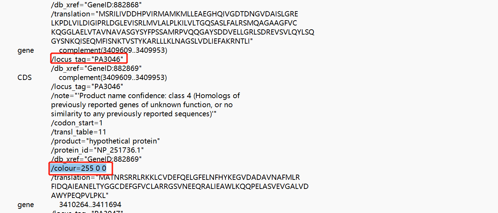

# YggL
## 数据下载
+ model organisms（outgroups）
```bash
GENUS=$(
    nwr member Bacteria -r genus |
        grep -v -i "Candidatus " |
        grep -v -i "candidate " |
        sed '1d' |
        cut -f 1 |
        tr "\n" "," |
        sed 's/,$//'
)

echo "
.headers ON

    SELECT
        *
    FROM ar
    WHERE 1=1
        AND genus_id IN ($GENUS)
        AND refseq_category IN ('reference genome')   #筛选条件
    " |
    sqlite3 -tabs ~/.nwr/ar_refseq.sqlite \
    > reference.tsv
```
| #tax_id | organism_name                                                    | phylum                |
|---------|------------------------------------------------------------------|-----------------------|
| 565050  | Caulobacter vibrioides NA1000                                    | Alphaproteobacteria   |
| 192222  | Campylobacter jejuni subsp. jejuni NCTC 11168 = ATCC 700819      | Epsilonproteobacteria |
| 208964  | Pseudomonas aeruginosa PAO1                                      | Gammaproteobacteria   |
| 871585  | Acinetobacter pittii PHEA-2                                      | Gammaproteobacteria   |
| 511145  | Escherichia coli str. K-12 substr. MG1655                        | Gammaproteobacteria   |
| 386585  | Escherichia coli O157:H7 str. Sakai                              | Gammaproteobacteria   |
| 1125630 | Klebsiella pneumoniae subsp. pneumoniae HS11286                  | Gammaproteobacteria   |
| 99287   | Salmonella enterica subsp. enterica serovar Typhimurium str. LT2 | Gammaproteobacteria   |
| 198214  | Shigella flexneri 2a str. 301                                    | Gammaproteobacteria   |
| 227377  | Coxiella burnetii RSA 493                                        | Gammaproteobacteria   |
| 272561  | Chlamydia trachomatis D/UW-3/CX                                  | Chlamydiae            |
| 93061   | Staphylococcus aureus subsp. aureus NCTC 8325                    | Firmicutes            |
| 224308  | Bacillus subtilis subsp. subtilis str. 168                       | Firmicutes            |
| 169963  | Listeria monocytogenes EGD-e                                     | Firmicutes            |
| 83332   | Mycobacterium tuberculosis H37Rv                                 | Actinobacteria        |

+ Gammaproteobacteria

Old ones: Cellvibrionales, Oceanospirillales, Pseudomonadales, and Alteromonadales

New ones: Moraxellales, Kangiellales, and Pseudomonadales
```bash
SPECIES=$(
    nwr member -r species \
        Cellvibrionales Oceanospirillales Alteromonadales \
        Moraxellales Kangiellales Pseudomonadales |
        grep -v -i "Candidatus " |
        grep -v -i "candidate " |
        grep -v " sp." |
        grep -v -E "\bbacterium\b" |
        grep -v -E "\bsymbiont\b" |
        sed '1d' |
        cut -f 1 |
        sort |
        uniq
)

for S in $SPECIES; do
    RS=$(
        echo "
            SELECT
                COUNT(*)
            FROM ar
            WHERE 1=1
                AND species_id = $S
            " |
            sqlite3 -tabs ~/.nwr/ar_refseq.sqlite
    )

    CHR=$(
        echo "
            SELECT
                COUNT(*)
            FROM ar
            WHERE 1=1
                AND species_id = $S
                AND assembly_level IN ('Complete Genome', 'Chromosome')
            " |
            sqlite3 -tabs ~/.nwr/ar_refseq.sqlite
    )

    if [[ ${RS} -gt 0 ]]; then
        echo -e "$S\t$RS\t$CHR"
    fi
done |
    nwr append stdin |
    tsv-select -f 1,4,2-3 |
    tsv-sort -k3,3nr -k4,4nr -k2,2 |
    (echo -e '#tax_id\tspecies\tRS\tCHR' && cat) \
    > species.count.tsv
```
 + download
```bash
SPECIES=$(
    cat species.count.tsv |
        tsv-filter -H --ge CHR:2 |
        sed '1d' |
        cut -f 1 |
        tr "\n" "," |
        sed 's/,$//'
)

# Pseudomonas aeruginosa PAO1 is in the reference list
cat reference.tsv |
    tsv-select -H -f organism_name,species,genus,ftp_path,assembly_level \
    > raw.tsv

echo "
    SELECT
        organism_name || ' ' || assembly_accession AS name,
        species, genus, ftp_path, assembly_level
    FROM ar
    WHERE 1=1
        AND species_id IN ($SPECIES)
        AND species NOT LIKE '% sp.%'
        AND organism_name NOT LIKE '% sp.%'
        AND assembly_level IN ('Complete Genome', 'Chromosome') #筛选条件
    " |
    sqlite3 -tabs ~/.nwr/ar_refseq.sqlite |
    tsv-filter --invert --str-eq 2:"Pseudomonas aeruginosa" --str-eq 5:"Chromosome" |
    tsv-filter --invert --str-eq 2:"Acinetobacter baumannii" --str-eq 5:"Chromosome" \
    >> raw.tsv

cat raw.tsv |
    grep -v '^#' |
    tsv-uniq |
    perl ~/Scripts/withncbi/taxon/abbr_name.pl -c "1,2,3" -s '\t' -m 3 --shortsub |
    (echo -e '#name\tftp_path\torganism\tassembly_level' && cat ) |
    perl -nl -a -F"," -e '
        BEGIN{my %seen};
        /^#/ and print and next;
        /^organism_name/i and next;
        $seen{$F[3]}++; # ftp_path
        $seen{$F[3]} > 1 and next;
        $seen{$F[5]}++; # abbr_name
        $seen{$F[5]} > 1 and next;
        printf qq{%s\t%s\t%s\t%s\n}, $F[5], $F[3], $F[1], $F[4];
        ' |
    keep-header -- sort -k3,3 -k1,1 \
    > Pseudomonas.assembly.tsv

# find potential duplicated strains or assemblies
cat Pseudomonas.assembly.tsv |
    tsv-uniq -f 1 --repeated

# Edit .tsv, remove unnecessary strains, check strain names and comment out poor assemblies.
# vim Pseudomonas.assembly.tsv
# cp Pseudomonas.assembly.tsv ~/Scripts/withncbi/pop

# Comment out unneeded strains

# Cleaning
rm raw*.*sv

perl ~/Scripts/withncbi/taxon/assembly_prep.pl \
    -f 。/Pseudomonas.assembly.tsv \
    -o ASSEMBLY

bash ASSEMBLY/Pseudomonas.assembly.rsync.sh
bash ASSEMBLY/Pseudomonas.assembly.collect.sh

#利用md5算法检验是否下载正确
cat ASSEMBLY/rsync.tsv |
    tsv-select -f 1 |
    parallel -j 4 --keep-order '
        echo "==> {}"
        cd ASSEMBLY/{}
        md5sum --check md5checksums.txt
    ' |
    grep -v ": OK"
```
## 模式细菌的物种树(bac120)
+ 下载bac120的hmm文件
```bash
mkdir -p ~/data/HMM/bac120
cd ~/data/HMM/bac120

cp ~/Scripts/withncbi/hmm/bac120.tsv ~/data/HMM/bac120/

mkdir -p HMM

cat ~/Scripts/withncbi/hmm/bac120.tsv |
    sed '1d' |
    tsv-select -f 1 |
    grep '^TIGR' |
    parallel --no-run-if-empty --linebuffer -k -j 4 '
        tar --directory HMM -xzvf ../TIGRFAM/TIGRFAMs_14.0_HMM.tar.gz {}.HMM
    '

cat ~/Scripts/withncbi/hmm/bac120.tsv |
    sed '1d' |
    tsv-select -f 1 |
    grep -v '^TIGR' |
    parallel --no-run-if-empty --linebuffer -k -j 4 '
        curl -L http://pfam.xfam.org/family/{}/hmm > HMM/{}.HMM
    '
```
```bash
E_VALUE=1e-20

cd ~/data/Pseudomonas

# Find all genes
for marker in $(cat ~/data/HMM/bac120/bac120.tsv | sed '1d' | cut -f 1); do
    echo "==> marker [${marker}]"

    mkdir -p PROTEINS/${marker}

    for GENUS in $(cat genus.lst); do
        echo "==> GENUS [${GENUS}]"

        for STRAIN in $(cat taxon/${GENUS}); do
            gzip -dcf ASSEMBLY/${STRAIN}/*_protein.faa.gz |
                hmmsearch -E ${E_VALUE} --domE ${E_VALUE} --noali --notextw ~/data/HMM/bac120/HMM/${marker}.HMM - |
                grep '>>' |
                STRAIN=${STRAIN} perl -nl -e '
                    />>\s+(\S+)/ and printf qq{%s\t%s\n}, $1, $ENV{STRAIN};
                '
        done \
            > PROTEINS/${marker}/${GENUS}.replace.tsv
    done

    echo
done
```
```bash
mkdir ~/data/Pseudomonas/model
cd ~/data/Pseudomonas/model

cat ../strains.taxon.tsv |
    grep -v "GCF" | 
    cut -f 1 > model.lst    
```
```bash
cd ~/data/Pseudomonas

# Extract sequences
cat ~/data/HMM/bac120/bac120.tsv | sed '1d' | cut -f 1 |
    parallel --no-run-if-empty --linebuffer -k -j 4 '
        >&2 echo "==> marker [{}]"
        
        cat PROTEINS/{}/{}.replace.tsv |
            grep -f model/model.lst | 
            grep -v "GCF" > PROTEINS/{}/{}.model.tsv
       
       faops some PROTEINS/all.uniq.fa <(
            cat PROTEINS/{}/{}.model.tsv |
                cut -f 1 |
                tsv-uniq
            ) stdout \
            > PROTEINS/{}/{}.model.fa
    '

# Align each markers with muscle
cat ~/data/HMM/bac120/bac120.tsv | sed '1d' | cut -f 1 |
    parallel --no-run-if-empty --linebuffer -k -j 4 '
        >&2 echo "==> marker [{}]"

        muscle -quiet -in PROTEINS/{}/{}.model.fa -out PROTEINS/{}/{}.model.aln.fa
    '

for marker in $(cat ~/data/HMM/bac120/bac120.tsv | sed '1d' | cut -f 1); do
    >&2 echo "==> marker [${marker}]"

    # 1 name to many names
    cat PROTEINS/${marker}/${marker}.model.tsv |
        parallel --no-run-if-empty --linebuffer -k -j 4 "
            faops replace -s PROTEINS/${marker}/${marker}.model.aln.fa <(echo {}) stdout
        " \
        > PROTEINS/${marker}/${marker}.model.replace.fa
done

# Concat marker genes
for marker in $(cat ~/data/HMM/bac120/bac120.tsv | sed '1d' | cut -f 1); do
    # sequences in one line
    faops filter -l 0 PROTEINS/${marker}/${marker}.model.replace.fa stdout

    # empty line for .fas
    echo
done \
    > PROTEINS/bac120.model.aln.fas

fasops concat PROTEINS/bac120.model.aln.fas model/model.lst -o PROTEINS/bac120.model.aln.fa

# Trim poorly aligned regions with `TrimAl`
trimal -in PROTEINS/bac120.model.aln.fa -out PROTEINS/bac120.model.trim.fa -automated1

# renname Cam_jej_jejuni_NCTC_11168_ATCC_700819 
sed -e "s/Cam_jej_jejuni_NCTC_11168_ATCC_700819/Cam_jej_jejuni_NCTC_11168/" PROTEINS/bac120.model.trim.fa > PROTEINS/bac120.model.rename.fa

# To make it faster
FastTree -fastest -noml PROTEINS/bac120.model.rename.fa > PROTEINS/bac120.model.newick
```
+ 调整进化树
```bash
cd ~/data/Pseudomonas/tree

nw_reroot ../PROTEINS/bac120.model.newick B_sub_subtilis_168 St_aur_aureus_NCTC_8325 |
    nw_order -c n - \
    > bac120.model.reroot.newick
```

## 所有物种的物种树
+ 筛选 

* Check N50 of assemblies

* Some strains were anomalously labeled and identified by the `mash` tree.
    * Pseudom_flu_GCF_900636635_1
    * Pseudom_chl_GCF_001023535_1
    * Pseudom_syr_GCF_004006335_1
    * Pseudom_puti_GCF_003228315_1 and Pseudom_puti_GCF_020172705_1
```bash
for dir in $(find ASSEMBLY -maxdepth 1 -mindepth 1 -type d | sort); do
    1>&2 echo "==> ${dir}"
    name=$(basename ${dir})

    find ${dir} -type f -name "*_genomic.fna.gz" |
        grep -v "_from_" | # exclude CDS and rna
        xargs cat |
        faops n50 -C -S stdin |
        (echo -e "name\t${name}" && cat) |
        datamash transpose
done |
    tsv-uniq |
    tee ASSEMBLY/n50.tsv

cat ASSEMBLY/n50.tsv |
    tsv-filter \
        -H --or \
        --le 4:100 \
        --ge 2:100000 |
    tsv-filter -H --ge 3:1000000 |   #筛选条件
    tr "\t" "," \
    > ASSEMBLY/n50.pass.csv

tsv-join \
    ASSEMBLY/Pseudomonas.assembly.collect.csv \
    --delimiter "," -H --key-fields 1 \
    --filter-file ASSEMBLY/n50.pass.csv |
    tsv-filter --delimiter "," -H --str-not-in-fld 1:GCF_900636635 |  #删去异常菌株
    tsv-filter --delimiter "," -H --str-not-in-fld 1:GCF_001023535 |
    tsv-filter --delimiter "," -H --str-not-in-fld 1:GCF_004006335 |
    tsv-filter --delimiter "," -H --str-not-in-fld 1:GCF_003228315 |
    tsv-filter --delimiter "," -H --str-not-in-fld 1:GCF_020172705 \
    > ASSEMBLY/Pseudomonas.assembly.pass.csv
```
+ count strains
```bash  
cat ASSEMBLY/Pseudomonas.assembly.pass.csv |
    sed -e '1d' |
    tr "," "\t" |
    tsv-select -f 1,2,3 |
    nwr append stdin -c 3 -r species -r genus -r family -r order |
    parallel --col-sep "\t" --no-run-if-empty --linebuffer -k -j 1 '
        if [[ "{#}" -eq "1" ]]; then
            rm strains.lst
            rm genus.tmp
            rm species.tmp
        fi

        echo {1} >> strains.lst

        echo {5} >> genus.tmp
        echo {1} >> taxon/{5}

        echo {4} >> species.tmp

        printf "%s\t%s\t%d\t%s\t%s\t%s\t%s\n" {1} {2} {3} {4} {5} {6} {7}
    ' \
    > strains.taxon.tsv

cat genus.tmp | tsv-uniq > genus.lst
cat species.tmp | tsv-uniq > species.lst 
```
+ MinHash
```bash
mkdir -p ~/data/Pseudomonas/mash
cd ~/data/Pseudomonas/mash

for strain in $(cat ../strains.lst ); do
    2>&1 echo "==> ${strain}"

    if [[ -e ${strain}.msh ]]; then
        continue
    fi

    find ../ASSEMBLY/${strain} -name "*_genomic.fna.gz" |
        grep -v "_from_" |
        xargs cat |
        mash sketch -k 21 -s 100000 -p 8 - -I "${strain}" -o ${strain}
done

mash triangle -E -p 8 -l <(
    cat ../strains.lst | parallel echo "{}.msh"
    ) \
    > dist.tsv

# fill matrix with lower triangle
tsv-select -f 1-3 dist.tsv |
    (tsv-select -f 2,1,3 dist.tsv && cat) |
    (
        cut -f 1 dist.tsv |
            tsv-uniq |
            parallel -j 1 --keep-order 'echo -e "{}\t{}\t0"' &&
        cat
    ) \
    > dist_full.tsv

cat dist_full.tsv |
    Rscript -e '
        library(readr);
        library(tidyr);
        library(ape);
        pair_dist <- read_tsv(file("stdin"), col_names=F);
        tmp <- pair_dist %>%
            pivot_wider( names_from = X2, values_from = X3, values_fill = list(X3 = 1.0) )
        tmp <- as.matrix(tmp)
        mat <- tmp[,-1]
        rownames(mat) <- tmp[,1]

        dist_mat <- as.dist(mat)
        clusters <- hclust(dist_mat, method = "ward.D2")
        tree <- as.phylo(clusters)
        write.tree(phy=tree, file="tree.nwk")

        group <- cutree(clusters, h=0.4) # k=5
        groups <- as.data.frame(group)
        groups$ids <- rownames(groups)
        rownames(groups) <- NULL
        groups <- groups[order(groups$group), ]
        write_tsv(groups, "groups.tsv")
    '
```
+ 调整进化树
```bash
mkdir -p ~/data/Pseudomonas/tree
cd ~/data/Pseudomonas/tree

nw_reroot ../mash/tree.nwk B_sub_subtilis_168 St_aur_aureus_NCTC_8325 |    
    nw_order -c n - \   
    > mash.reroot.newick
# 以B_sub_subtilis_168 St_aur_aureus_NCTC_8325为外类群，重新画根
# -c:specify order criterion  n:number of descendants,nodes with fewer descendans appear first

# rank::col
ARRAY=(
#    'order::7'
    'family::6'
    'genus::5'
    'species::4'
)

rm mash.condensed.map
CUR_TREE=mash.reroot.newick

for item in "${ARRAY[@]}" ; do
    GROUP_NAME="${item%%::*}"
    GROUP_COL="${item##*::}"

    bash ~/Scripts/withncbi/taxon/condense_tree.sh ${CUR_TREE} ../strains.taxon.tsv 1 ${GROUP_COL}

    mv condense.newick mash.${GROUP_NAME}.newick
    cat condense.map >> mash.condensed.map

    CUR_TREE=mash.${GROUP_NAME}.newick
done

# png
nw_display -s -b 'visibility:hidden' -w 600 -v 30 mash.species.newick |
    rsvg-convert -o Pseudomonas.mash.png
```
## 计算YggL在每个菌株中的拷贝数
### hmmersearch
```bash
Usage: hmmsearch [options] <hmmfile> <seqdb>
用法：hmmsearch 参数 hmm文件 序列数据库

mkdir -p YggL/HMM  #存放YggL蛋白的hmm文件(两个数据库)
curl -L http://pfam.xfam.org/family/PF04320/hmm > YggL/HMM/YggL_50S_bp.hmm
curl -L www.pantherdb.org/panther/exportHmm.jsp?acc=PTHR38778 > YggL/HMM/PTHR38778.hmm

# 比对
E_VALUE=1e-20
for domain in YggL_50S_bp PTHR38778; do
    >&2 echo "==> domain [${domain}]"

    if [ -e YggL/${domain}.replace.tsv ]; then
        continue;
    fi

    for GENUS in $(cat genus.lst); do
        >&2 echo "==> GENUS [${GENUS}]"

        for STRAIN in $(cat taxon/${GENUS}); do
            gzip -dcf ASSEMBLY/${STRAIN}/*_protein.faa.gz |
                hmmsearch -E ${E_VALUE} --domE ${E_VALUE} --noali --notextw YggL/HMM/${domain}.hmm - |
                grep '>>' |
                STRAIN=${STRAIN} perl -nl -e '
                    />>\s+(\S+)/ or next;
                    $n = $1;
                    $s = $n;
                    $s =~ s/\.\d+//;
                    printf qq{%s\t%s_%s\n}, $n, $ENV{STRAIN}, $s;
                '
        done
    done \
        > YggL/${domain}.replace.tsv

    >&2 echo
done

tsv-join YggL/YggL_50S_bp.replace.tsv \
    -f YggL/PTHR38778.replace.tsv \
    > YggL/YggL.replace.tsv

cat YggL/YggL.replace.tsv | grep -v "GCF"
NP_417434.4     E_coli_K_12_MG1655_NP_417434
NP_311862.2     E_coli_O157_H7_Sakai_NP_311862
YP_005228761.1  K_pne_pneumoniae_HS11286_YP_005228761
NP_251736.1     Pseudom_aer_PAO1_NP_251736
NP_250533.1     Pseudom_aer_PAO1_NP_250533
NP_462024.1     Sa_ente_enterica_Typhimurium_LT2_NP_462024
NP_708730.3     Shi_fle_2a_301_NP_708730
#在6个模式菌株中检测到yggl蛋白
```
+ hummsearch统计
```bash
cd YggL
cat YggL.replace.tsv | cut -f 2 > protine.txt
cat ../PROTEINS/all.strain.tsv | grep -f protine.txt | cut -f 2 > statistic.txt
perl statistics.pl

# 将没有YggL的菌株添加到结果文件中
cat RESULT.txt | cut -f 1 > own.txt
ZERO=$(cat ../strains.lst | grep -v -f own.txt)
for Z in $ZERO; do
    echo -e "$Z\t0" >> RESULT.txt
    done
cat RESULT.txt | wc -l
#1526
```
```bash
mkdir -p ~/data/Pseudomonas/YggL/table
cd ~/data/Pseudomonas/YggL/table

cat ../../strains.taxon.tsv | cut -f 1,4 > join.tsv
cat ../RESULT.txt | sort -nr -k2,2 > RESULT.tsv

(echo -e "#name\tnumber" && cat RESULT.tsv) \
    > tem &&
    mv tem RESULT.tsv

(echo -e "#name\tspecies" && cat join.tsv) \
    > tem &&
    mv tem join.tsv

tsv-join -H --filter-file join.tsv \
    --key-fields 1 \
    --append-fields 2 \
    RESULT.tsv \
    > number_species.tsv
```
```bash
cat number_species.tsv | 
    cut -f 2,3 > statistic.tsv
    
tsv-summarize -H \
    --sum 1 \
    --group-by 2 \
    statistic.tsv > species_number.tsv     

cat join.tsv | cut -f 2 | sed '1d' > statistic.txt
perl ~/data/Pseudomonas/script/statistics.pl

(echo -e "species\tnumber of assemblies" && cat RESULT.txt) \
    > tem &&
    mv tem species_assembly.tsv

tsv-join --filter-file species_number.tsv \
    --key-fields 1 \
    --append-fields 2 \
    species_assembly.tsv \
    > table.tsv

cat table.tsv | tr "\t" "," > table.csv
```
+ 筛选
```bash
# 组装数大于5的
cat table.tsv | tsv-filter -H --ge 2:5 | sed '1d' > ge5.tsv

# 平均数大于1或者小于1的+Azotobacter vinelandii
cat << 'EOF' > average.lst
Pseudomonas citronellolis
Pseudomonas knackmussii
Pseudomonas aeruginosa
Pseudomonas plecoglossicida
Pseudomonas arsenicoxydans
Shewanella cyperi
Pseudomonas mandelii
Shewanella putrefaciens
Pseudomonas chlororaphis
Pseudomonas viridiflava
Pseudomonas putida
Azotobacter vinelandii
Pseudomonas fiuorescens
EOF
cat table.tsv | grep -f average.lst > average.tsv 

# 两种筛选条件取并集
cat ge5.tsv | grep -f average.tsv > intersection.tsv #交集
cat ge5.tsv | grep -v -f intersection.tsv > rest1.tsv
cat average.tsv | grep -v -f intersection.tsv > rest2.tsv

(echo -e "species\tnumber of assemblies\tnumber of yggl" && cat intersection.tsv) \
    > tem &&
    mv tem intersection.tsv

# 将其余的物种合并为other species
cat intersection.tsv | cut -f 1 | sed '1d' > select.lst

cat table.tsv | grep -v -f select.lst | cut -f 2,3 > other_species.tsv

cat other_species.tsv | tr "\t" "," > other_species.csv

cat intersection.tsv | tr "\t" "," | sort -nr -k2,2 > terminal.csv
```
### Blastp
+ 第一次检索
```bash
mkdir -p ~/data/Pseudomonas/blastp
cd ~/data/Pseudomonas/blastp

# 检索yggl的蛋白质序列并下载
cat << 'EOF' > yggl.fa
>NP_417434.4 putative ribosome assembly factor YggL [Escherichia coli str. K-12 substr. MG1655]
MAKNRSRRLRKKMHIDEFQELGFSVAWRFPEGTSEEQIDKTVDDFINEVIEPNKLAFDGSGYLAWEGLICMQEIGKCTEEHQAIVRKWLEERKLDEVRTSELFDVWWD
EOF

makeblastdb -in ./yggl.fa -dbtype prot -parse_seqids -out ./index

blastp -query ../PROTEINS/all.replace.fa -db ./index -evalue 1e-10 -outfmt 6 -num_threads 6 -out out_file

cat out_file | wc -l # 1312
```
+ 以第一次检索结果为种子序列，进一步进行检索
```bash
mkdir -p seed1
cd seed1

cat ../out_file | cut -f 1 > seed1.lst
faops ../../PROTEINS/all.replace.fa seed1.lst seed1_raw.fa

#一些序列名称太长，无法建库，需要对序列名称进行修改再进行建库

makeblastdb -in ./seed1.fa -dbtype prot -parse_seqids -out ./index

blastp -query ../../PROTEINS/all.replace.fa -db ./index -evalue 1e-10 -outfmt 6 -num_threads 6 -out out_file

cat out_ file | cut -f 1 | uniq | wc -l #1312
```

+ blastp统计
```bash
mkdir -p table
cd  table

cat ../out_file | cut -f 1 > protein.tsv
cat ../../PROTEINS/all.strain.tsv |
    grep -f protein.tsv > protein.strain.tsv

cat protein.strain.tsv | cut -f 2 > statistic.txt
perl statistics.pl

cat ../RESULT.txt | sort -nr -k2,2 > RESULT.tsv
cat ../../strains.taxon.tsv | cut -f 1,4 > join.tsv

(echo -e "#name\tnumber" && cat RESULT.tsv) \
    > tem &&
    mv tem RESULT.tsv

(echo -e "#name\tspecies" && cat join.tsv) \
    > tem &&
    mv tem join.tsv

tsv-join -H --filter-file join.tsv \
    --key-fields 1 \
    --append-fields 2 \
    RESULT.tsv \
    > number_species.tsv
    
cat number_species.tsv | 
    cut -f 2,3 > statistic.tsv  

tsv-summarize -H \
    --sum 1 \
    --group-by 2 \
    statistic.tsv > species_number.tsv 
```
```bash
cat join.tsv | cut -f 2 | sed '1d' > statistic.txt
perl ~/data/Pseudomonas/script/statistics.pl

(echo -e "species\tnumber of assemblies" && cat RESULT.txt) \
    > tem &&
    mv tem species_assembly.tsv

tsv-join --filter-file species_number.tsv \
    --key-fields 1 \
    --append-fields 2 \
    species_assembly.tsv \
    > table.tsv

```
## YggL蛋白树构建
+ 提取所有蛋白
```bash
mkdir -p PROTEINS

for STRAIN in $(cat strains.lst); do
    gzip -dcf ASSEMBLY/${STRAIN}/*_protein.faa.gz
done \
    > PROTEINS/all.pro.fa

#更改序列名称
for STRAIN in $(cat strains.lst); do
    gzip -dcf ASSEMBLY/${STRAIN}/*_protein.faa.gz |
        grep "^>" |
        cut -d" " -f 1 |
        sed "s/^>//" |
        STRAIN=${STRAIN} perl -nl -e '
            $n = $_;
            $s = $n;
            $s =~ s/\.\d+//;
            printf qq{%s\t%s_%s\t%s\n}, $n, $ENV{STRAIN}, $s, $ENV{STRAIN};
        ' \
    > PROTEINS/${STRAIN}.replace.tsv

    cut -f 2,3 PROTEINS/${STRAIN}.replace.tsv >> PROTEINS/all.strain.tsv

    faops replace -s ASSEMBLY/${STRAIN}/*_protein.faa.gz <(cut -f 1,2 PROTEINS/${STRAIN}.replace.tsv) stdout

    rm PROTEINS/${STRAIN}.replace.tsv
done \
    > PROTEINS/all.replace.fa
```
### 模式生物的蛋白树
```bash
mkdir -p ~/data/Pseudomonas/model/protein
cd ~/data/Pseudomonas/model/protein

cat ../../YggL/YggL.replace.tsv | 
    grep -f ../model.lst |
    grep -v "GCF" | 
    cut -f 2 > filter.lst

faops some ../../PROTEINS/all.replace.fa filter.lst model.pro.fa

muscle -in model.pro.fa -out model.aln.fa

FastTree model.aln.fa > model.aln.newick
```

### 所有菌株的蛋白树
+ 提取YggL蛋白
```bash
mkdir -p YggL/HMM

faops some PROTEINS/all.replace.fa <(tsv-select -f 2 YggL/YggL.replace.tsv) YggL/YggL.fa
```
+ 建树
```bash
muscle -in YggL/YggL.fa -out YggL/YggL.aln.fa

FastTree YggL/YggL.aln.fa > YggL/YggL.aln.newick

nw_reroot YggL/YggL.aln.newick $(nw_labels YggL/YggL.aln.newick | grep -E "B_sub|St_aur") |
    nw_order -c n - \
    > YggL/YggL.reoot.newick
```


## 合并模式菌株的蛋白树和物种树
+ 利用R的ape包中的cophyloplot函数
```bash
cd ~/data/Pseudomonas/model/protein
cp ../../tree/bac120.model.reroot.newick ./

#以铜绿假单胞菌画根
nw_reroot bac120.trim.newick $(nw_labels bac120.trim.newick | grep "PAO1") > bac120.protein.newick

R
library(ape)
tree1=read.tree("bac120.model.reroot.newick")
tree2=read.tree("bac120.protein.newick")
cophyloplot(tree1, tree2, length.line=4, space=28, gap=3, rotate=TRUE)
```


+ 利用R的ggtree包合并两棵树
```bash
cd ~/data/Pseudomonas/model/protein
cp ../../tree/bac120.model.reroot.newick ./

#以铜绿假单胞菌画根
nw_reroot bac120.trim.newick $(nw_labels bac120.trim.newick | grep "PAO1") > bac120.protein.newick

R
library(dplyr)
library(ggtree)
tree1=read.tree("bac120.model.reroot.newick")
tree2=read.tree("bac120.protein.newick")
p1 <- ggtree(tree1)
p2 <- ggtree(tree2)

d1 <- p1$data
d2 <- p2$data

d2$x <- max(d2$x) - d2$x + max(d1$x) + 1 #翻转第二棵树
d2$y <- d2$y + 8 #将第二棵树向上移动对齐
p3 <- ggtree::rotate(p1,29) #旋转node，使两棵树拓扑结构一致

pp <- p3 + geom_tiplab(offset=0.05) + geom_treescale()+ geom_highlight(node=25,fill="red")+ geom_tree(data=d2) + geom_tiplab(data = d2, hjust=1, offset =-0.05)+geom_treescale(x=2)

#geom_tiplab(offset=0.05) 添加label，offset：label与树枝末端距离
#geom_treescale() #添加表尺
#geom_highlight(node=25,fill="red") #添加红色区域
```


在物种树中铜绿假单胞菌（红色）聚到一支上，而在蛋白树中，铜绿假单胞菌中的YggL蛋白却明显分为两支

### 比较铜绿假单胞菌两个yggl蛋白的motif

+ motif简介

motif这个单词形容一种反复出现的模式，而序列motif往往是DNA上的反复出现的比较有特征的短序列，并被假设拥有生物学功能。而且，经常是一些具有序列特异性的蛋白的结合位点（如，转录因子）或者是涉及到重要生物过程的（如，RNA 起始，RNA 终止， RNA 剪切等等）

+ MEME的安装
```bash
brew install MEME
```
>**简介**
>
>   MEME是一款用于研究Motif的组合工具套。MEME包含多个小工具，如MEME、STREME、 CentriMo、 AME、 FIMO、 Tomtom等等。MEME工具套的功能全面，包括挖掘Motif（Motif Discovery）、富集Motif（Motif Enrichment）、查询Motif（Motif Scanning）、比较Motif（Motif Comparison）。
>    
>   (一) motif discovery
>
>   挖掘 Motif 是指：MEME 基于用户所提供的序列，根据特定的算法，预测（Predict） 序列中可能包含的 Motif。需要注意的是，挖掘 Motif 的算法不是将序列与数据库中已知的 Motif 比对，也不是用已知的 Motif 模型对序列进行扫描（Scanning），而是基于用于提供的序列信息独立计算出的，即全新的Motif。MEME是最基本的挖掘 Motif 模块，可以在少量（<50）的序列中挖掘全新（novel）、无间隙（ungapped）的Motif；STREME相比MEME可以在大量（>50） 的序列中挖掘全新、无间隙、富集的Motif。
>
>   输入：Fasta 序列;输出：序列中预测包含的Motif
>
>   （二）motif enrichment
>   
>   富集 Motif 是指：以一组序列为对照组，挖掘在另一组序列中富集且已知的 Motif。
>
>   输入：Fasta 序列;输出：序列中富集且已知的 Motif   
>
>   （三）motif scanning
>
>   扫描 Motif 是指：用特定 Motif（用户上传）扫描序列（公共数据库或用户上传），筛选出包含特定 Motif 的序列。
>
>   输入：Motif 模型;输出：包含 Motif 的序列
>
>   （四）motif comparision
>   
>   比较 Motif 是指：将用户上传的 Motif 与数据库中已知的 Motif 比较，筛选出与上传 Motif 相似的已知 Motif。可以将挖掘 Motif 模块找到的 Motif 作为输入，寻找数据库中与其相似的 Motif，预测挖掘到 Motif 的功能。 注意，AME 的输入是序列，Tomtom 的输入是 Motif。
>
>   输入：Motif 模型;输出：已知 的 Motif 模型
>
>   工具：Tomtom
+ MEME的使用
```bash
# 选取代表性菌株，分离两种yggl序列
cd ~/data/Pseudomonas/motif
cat ../ASSEMBLY/Pseudomonas.assembly.pass.csv | grep "Representative Genome" > representative.csv
cat representative.csv | cut -d "," -f 1 > representative.lst
cat ../model/model.lst >> representative.lst

cat data.size.tsv | grep -f representative.lst | sort -nr -k2,2 > representative.pro.lst
```
+ 根据进化树分离两种不同的拷贝


红色区域为yggl的第二个拷贝

```bash
cat representative.pro.lst | tsv-filter --gt 2:115 | grep -v "She_fle_2a_301_NP_708730" > yggl2.lst
cat representative.pro.lst | grep -v -f yggl2.lst | cut -f 1 > yggl1.lst

faops some data.fa yggl1.lst yggl1.fa
faops some data.fa yggl2.lst yggl2.fa
```
+ [网页版](https://meme-suite.org/meme/)使用


分别上传yggl.fa与yggl2.fa

+ 结果分析


### 观察motif在yggl蛋白中的位置
+ 利用[Interpro](https://www.ebi.ac.uk/interpro/entry/InterPro/IPR007416/rosettafold/)网站查询yggl蛋白结构


根据之前motif的位置查看motif在蛋白中的位置

### 观察yggl蛋白的侧翼基因
+ 利用[Pseudomonas Genome DB](https://www.pseudomonas.com/)网站，查询yggl蛋白


### 基因岛分析
+ 在[Islandviewer4网站](https://www.pathogenomics.sfu.ca/islandviewer/upload/)中上传PAO1的genbank文件


+ 结果分析

圈图展示基因组上预测出的基因岛的分布、位置、不同颜色表示对应的分析方法，圈图的内圈是基因组G+C含量的变化，一般基因岛的G+C含量会显著偏离基因组G+C含量的平均水平。

圆圈图下面的方块图中，最上面两行方块展示了注释的蛋白，下面的三行方块表示不同分析方法对应的基因岛区域。

圆圈中的圆点代表毒力因子，抗性基因等。点击downkoad下载基因岛区域的相关信息


+ 查找yggl蛋白是否在预测的基因岛区域

通过Pseudomonas Genome DB网站，我们了解，yggl蛋白的编号为PA3046，在基因岛区域中并未查询到PA3046蛋白？？

猜想：PA3046为铜绿假单胞菌中的第一个拷贝，并非通过水平基因转移而来，而第二个拷贝可能是通过水平基因转移而来

+ 查找yggl第二个拷贝的蛋白编号或者位置

根据blastp结果，ncbi检索PAO1中两个yggl蛋白的编号NP_250533(120)和NP_251736(114),蛋白编号分别为PA1842(NP_250533)和PA3046(NP_251736)

**结论**：两种蛋白在基因岛中均未找到，铜绿假单胞菌中的第二个yggl拷贝不是近期通过水平基因转移获得

### EasyFig

```bash
# 准备typical菌株的genbank数据和genome数据

mkdir ~/data/Pseudomonas/easyfig
cd ~/data/Pseudomonas/easyfig

for S in \
    Pseudom_aeru_PAO1 \
    Pseudom_puti_KT2440_GCF_000007565_2 \
    Pseudom_chl_aureofaciens_30_84_GCF_000281915_1 \
    Pseudom_entomophi_L48_GCF_000026105_1 \
    Pseudom_fluo_SBW25_GCF_000009225_2 \
    Pseudom_prot_Pf_5_GCF_000012265_1 \
    Pseudom_sav_pv_phaseolicola_1448A_GCF_000012205_1 \
    Pseudom_stu_A1501_GCF_000013785_1 \
    Pseudom_syr_pv_syringae_B728a_GCF_000012245_1 \
    Pseudom_aeru_UCBPP_PA14_GCF_000014625_1 \
    Pseudom_aeru_PA7_GCF_000017205_1 \
    Pseudom_aeru_LESB58_GCF_000026645_1 \
    ; do
    echo ${S}
done \
    > typical.lst

mkdir genbank
cat typical.lst |
    parallel --no-run-if-empty --linebuffer -k -j 4 '
        compgen -G "../ASSEMBLY/{}/*_genomic.gbff.gz"
    ' |
    paste - - \
    > genbank/genbank.list
for G in $(cat genbank/genbank.lst);do
    cp $G genbank
done
gzip -d genbank/*.gz
```
+ 输入菌株的genbank文件选择所需要对比的基因区域(Image-Subregions)，利用easyfig进行blast（Image-Blast）比对

+ 修改菌株的genbank文件，在特定的基因数据下面添加/colour=RGB色码，可以再最终的比较图中显示




### Pangenome
参考文献：[PPanGGOLiN: Depicting microbial diversity via a partitioned pangenome graph](https://journals.plos.org/ploscompbiol/article?id=10.1371/journal.pcbi.1007732)

```bash
cd ~/data/Pseudomonas

mkdir -p pangenome

cat strains.lst |
    grep "^Pseudom_aeru_" |
    parallel --no-run-if-empty --linebuffer -k -j 4 '
        GBFF=$(compgen -G "ASSEMBLY/{}/*_genomic.gbff.gz")

        if [ "${GBFF}" == "" ]; then
            exit;
        fi

        echo {}
        compgen -G "ASSEMBLY/{}/*_genomic.gbff.gz"
    ' |
    paste - - \
    > pangenome/Pseudom_aeru.gbff.list

wc -l < pangenome/Pseudom_aeru.gbff.list
# 391

ppanggolin workflow --anno pangenome/Pseudom_aeru.gbff.list --cpu 8 -o pangenome/Pseudom_aeru
```
+ 下载Gephi

打开pangenomeGraph.gexf,分布方式：ForceAtlas 2

参数:缩放 8000；更强的重力 打开；重力 2；边的权重影响 1.2；过滤-范围-nb gene long（节点） >7

### WGCNA

+ 获得基因表达矩阵

在pseudomonas db网站中查看PAO1菌株的expression界面，下载soft文件

编辑soft文件，保留其中的距离矩阵，删除其中含有表达量为null的菌株

+ 利用R中的WGCNA包进行分析

```R
library(WGCNA)
library(reshape2)
library(stringr)

options(stringsAsFactors = FALSE)
enableWGCNAThreads()

exprMat <- "GDS1469.soft"
dataExpr <- read.table(exprMat, sep='\t', row.names=1, header=T,
                     quote="", comment="", check.names=F)

type = "signed"
corType = "bicor"

dim(dataExpr)
head(dataExpr)[,1:5]

dataExpr <- as.data.frame(t(dataExpr[,-1]))
head(dataExpr)[,1:5]
dim(dataExpr)

powers = c(c(1:10), seq(from = 12, to=30, by=2))
sft = pickSoftThreshold(dataExpr, powerVector=powers,
                        networkType=type, verbose=5)

power = sft$powerEstimate
power

nGenes = ncol(dataExpr)
nSamples = nrow(dataExpr)
if (is.na(power)){
  power = ifelse(nSamples<20, ifelse(type == "unsigned", 9, 18),
          ifelse(nSamples<30, ifelse(type == "unsigned", 8, 16),
          ifelse(nSamples<40, ifelse(type == "unsigned", 7, 14),
          ifelse(type == "unsigned", 6, 12))
          )
          )
}

net = blockwiseModules(dataExpr, power = power, maxBlockSize = nGenes,
                       TOMType = type, minModuleSize = 100,
                       reassignThreshold = 0, mergeCutHeight = 0.3,
                       numericLabels = TRUE, pamRespectsDendro = FALSE,
                       saveTOMs = TRUE, corType = corType,
                       loadTOMs = TRUE,
                       saveTOMFileBase = paste0(exprMat, ".tom"),
                      verbose = 3)
table(net$colors)

moduleLabels = net$colors
moduleColors = labels2colors(moduleLabels)
plotDendroAndColors(net$dendrograms[[1]], moduleColors[net$blockGenes[[1]]],
                    "Module colors",
                    dendroLabels = FALSE, hang = 0.03,
                    addGuide = TRUE, guideHang = 0.05)

MEs = net$MEs
MEs_col = MEs
colnames(MEs_col) = paste0("ME", labels2colors(
  as.numeric(str_replace_all(colnames(MEs),"ME",""))))
MEs_col = orderMEs(MEs_col)
plotEigengeneNetworks(MEs_col, "Eigengene adjacency heatmap",
                      marDendro = c(3,3,2,4),
                      marHeatmap = c(3,4,2,2), plotDendrograms = T,
                      xLabelsAngle = 90)

load(net$TOMFiles[1], verbose=T)
TOM <- as.matrix(TOM)
probes = colnames(dataExpr)
dimnames(TOM) <- list(probes, probes)
cyt = exportNetworkToCytoscape(TOM,
             nodeFile = paste(exprMat, ".nodes.txt", sep=""),
             weighted = TRUE, threshold = 0,
             nodeNames = probes, nodeAttr = moduleColors)

```
+ 提取样本中与yggl拷贝在一个基因集的基因
```bash
mkdir ~/data/Pseudomonas/WGCNA/select
cd ~/data/Pseudomonas/WGCNA/select

cp ./*.txt ./ 
JOB=$(ls | cut -d "." -f 1)

for J in $JOB;do 
    YGGL1=$(cat $J.soft.nodes.txt | grep "PA1842" | cut -f 3)
    YGGL2=$(cat $J.soft.nodes.txt | grep "PA3046" | cut -f 3) 
    cat $J.soft.nodes.txt | grep "$YGGL1" >> $J.select.txt
    cat $J.soft.nodes.txt | grep "$YGGL2" >> $J.select.txt
    done

```

+ 修改
```bash
# *.select.txt文件中，理论上应该是只含有两种颜色的基因集，如果含有一种，则可能是两个拷贝被聚在了一起，如果含有多种，手动查看筛选
for J in $JOB;do
    COLOUR=$(cat $J.select.txt | cut -f 3 | sort | uniq | wc -l)
    echo -e "$J\t$COLOUR"
    done

GDS1469 3
GDS1910 2
GDS2111 2
GDS2317 2
GDS2377 1
GDS2502 2
GDS2764 2
GDS2869 2
GDS2870 1
GDS2893 1
GDS3251 2
GDS3572 2
GDS4244 2
GDS4249 2
GDS4250 2
GDS4254 1
GDS4457 2
GDS4479 2
GDS4958 2
GDS4959 2

# 用上述方法提取基因集是，发现在GDS1469中，提取黄色（yellow）基因集时，也提取出了黄绿色（greenyellow）基因集，重新筛选一下
cat GDS1469.select.txt | grep -v "greenyellow"  \
    > tem &&
    mv tem GDS1469.select.txt

# GDS2377,GDS2870,GDS2893,GDS4254这些样本中，两个拷贝聚在了一起，统计了两次，需要进行一下删减
for PROJECT in GDS2377 GDS2870 GDS2893 GDS4254;do
    cat $PROJECT.select.txt | sort | uniq > tem &&
    mv tem $PROJECT.select.txt
    done

# 检验
for J in $JOB;do 
    NUMBER=$(cat $J.select.txt | grep "PA1842" | wc -l)
    echo -e "$J\t$NUMBER"
done    
```

+ 筛选

标准：这个基因出现的频率为50%
```bash
# 合并
for J in $JOB;do 
    YGGL1=$(cat $J.select.txt | grep "PA1842" | cut -f 3)
    YGGL2=$(cat $J.select.txt | grep "PA3046" | cut -f 3) 
    cat $J.select.txt | grep "$YGGL1" >> PA1842.select.txt
    cat $J.select.txt | grep "$YGGL2" >> PA3046.select.txt
done

# 删去灰色基因集
cat PA1842.select.txt | grep -v "grey"  \
    > tem &&
    mv tem PA1842.select.txt
    
cat PA3046.select.txt | grep -v "grey"  \
    > tem &&
    mv tem PA3046.select.txt

# 统计不同基因出现的次数
cat PA1842.select.txt | cut -f 1 > statistic.txt
perl statistics.pl
rm statistic.txt
mv RESULT.txt PA1842.statistic.txt
cat PA1842.statistic.txt | grep "PA1842"
# PA1842_at       15
cat PA1842.statistic.txt | tsv-filter --ge 2:7 | wc -l #534
cat PA1842.statistic.txt | tsv-filter --ge 2:6 | wc -l #1370
cat PA1842.statistic.txt | tsv-filter --ge 2:6 | cut -f 1 > PA1842.cluster.txt

# 同理，找出出与PA3046聚在一起的基因 PA3046.cluster.txt
cat PA3046.statistic.txt | grep "PA3046"
# PA3046_at       17
cat PA3046.statistic.txt | tsv-filter --ge 2:6 | wc -l #1513
cat PA3046.statistic.txt | tsv-filter --ge 2:7 | wc -l #637
cat PA3046.statistic.txt | tsv-filter --ge 2:7 | cut -f 1 > PA3046.cluster.txt

#取交集
cat PA1842.cluster.txt | grep -f PA3046.cluster.txt > collect.txt
cat PA1842.cluster.txt | grep -f PA3046.cluster.txt | wc -l #173
```


### 合并所有的GEO文件
```bash
tsv-join --filter-file GDS1910.soft --H --key-fields ID_REF,IDENTIFIER --append-fields 'GSM*' GDS1469.soft > merge.soft
```

### 将表达矩阵按照实验条件拆分
```bash
mkdir ~/data/Pseudomonas/WGCNA/job
cd job

cat ../project/GDS1469.soft | cut -f 1,2 > head.soft
tsv-join --filter-file GDS1469.soft --H --key-fields ID_REF,IDENTIFIER --append-fields GSM68692,GSM68693,GSM68694 head.soft > GDS1469.1.soft
#以此类推，分出其余实验条件的表达矩阵
rm head.soft

#删除其中存在null的数据（直接删除整个样本）
for J in $JOB;do
    JUDGE=$(cat $J.soft | grep "null")
    if [ ! -n "$JUDGE" ]; then
        echo -e "$J is ok"
    else
        echo -e "$J need control"
    fi
done
GDS1469_1 need control
GDS1910_2 need control
GDS2893_2 need control
GDS3174_1 need control
GDS3174_2 need control
# GDS1469_1中null太多，直接删除
rm GDS1469_1.soft

cat GDS1910_2.soft | cut -f 1,2,4 \
    > tem&&
    mv tem GDS1910_2.soft

cat GDS2893_2.soft | cut -f 1,2,5 \
    > tem&&
    mv tem GDS2893_2.soft

cat GDS2893_2.soft | cut -f 1,2,5 \
    > tem&&
    mv tem GDS2893_2.soft
    
# GDS3174_1和GDS3174_2中null太多，直接删除
rm GDS3174_1.soft GDS3174_2.soft
```
```R
JOB <- list.files(path = ".")

for(J in JOB) {
    exprMat <- J
    source("rest.r")
}
```

### 俩俩组合
```bash
mkdir ~/data/Pseudomonas/WGCNA/finish
mkdir ~/data/Pseudomonas/WGCNA/combine

cd job
for i in {1..110};do
    COMBINE=$(ls | head -n 1)
    NAME1=$(ls | head -n 1 | cut -d '.' -f 1)
    mv $COMBINE ../finish
    REST=$(ls)
    for R in $REST;do
        NAME2=$(echo $R | cut -d '.' -f 1)
        tsv-join --filter-file $R --H --key-fields ID_REF,IDENTIFIER --append-fields 'GSM*' ../finish/$COMBINE > ../combine/$NAME1.$NAME2.soft
    done
done 
```
